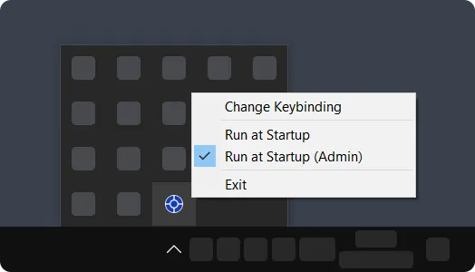

#  Centawin

`Centawin` is a super simple, lightweight, and portable Windows utility that does only one thing: **centers the focused window** via the hotkey. It works great with **multi-monitor configurations**. The program has **no graphical interface**. All settings are made in the tray menu. The default hotkey can be changed.



## How to Use

1. Run `centawin.exe`.
2. Focus a window.
3. Press the `Win` **+** `Shift` **+** `Q` keybinding (or your custom one).

## How to Center a Window with Administrative Privileges

You need to run `Centawin` with **administrative privileges**.

## Version without Tray Icon

If you don't want to see a tray icon, use [Centawin v1.1.1](https://github.com/emsaicer/Centawin/releases/tag/v1.1.1).

## How to Build

Run `build.bat`.

OR

```
windres resources.rc -o resources.o && clang main.c -lole32 -luuid "-Wl,--gc-sections" -mwindows -s -Os resources.o -o centawin.exe && del resources.o
```